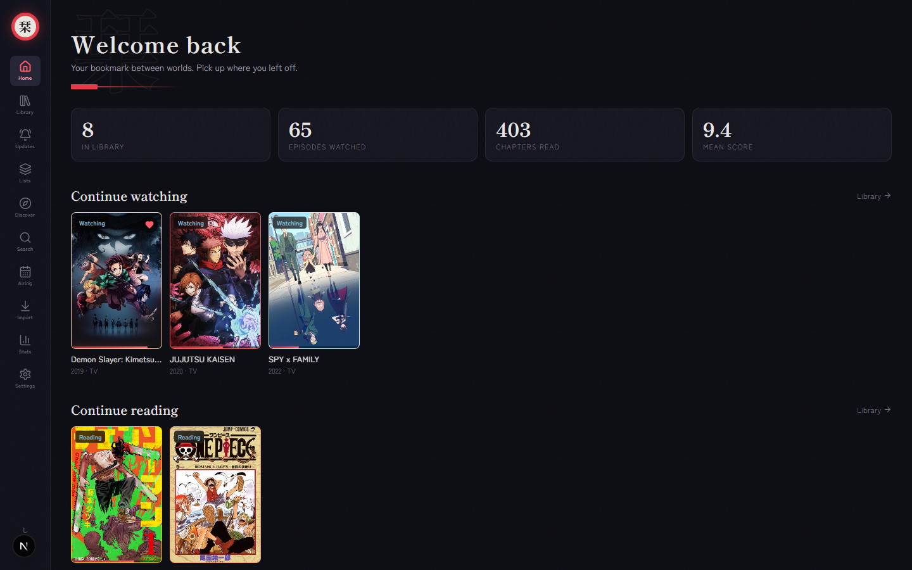

<div align="center">
  

  # 栞 Shiori

  **A local-first tracker for everything you watch and read.**

  [](LICENSE)
  [](https://nextjs.org/)
  [](https://www.typescriptlang.org/)
  [](https://react.dev/)
  [](https://tailwindcss.com/)
  [](#)
  [](#)

</div>

<br/>

**Shiori** (栞, "bookmark") keeps every anime, manga, manhwa and manhua you're into in
one shelf — imported from the services you already use, stored entirely in your own
browser. No sign-up, no server, no tracking. Rate it, review it, sort it into lists,
and watch your year take shape on an activity heatmap.

## Preview



## Features

- **Import** — pull in your existing lists from AniList (just a username), MyAnimeList
  (official API), and Kitsu, or parse a Mihon / Tachiyomi-family backup file straight
  in your browser. Cross-service dedupe keeps AniList, MAL and Kitsu entries mapped to
  the same series instead of creating duplicates.
- **Library** — tabs per type, status filters, sorting, search, grid or list view,
  quick +1 progress, favorites
- **Series pages** — synopsis, genres/tags, characters with voice actors, related
  series, "similar to this" recommendations, community ratings and content notes, plus
  chapter lists pulled live from a handful of scanlation aggregators with mark-read-up-to
- **Your data, your words** — 10-point ratings with halves, markdown reviews, quick notes
- **Stats** — totals, days watched, score distribution, genre and type breakdowns,
  a GitHub-style activity heatmap, and a yearly wrap-up
- **Custom lists** — curated shelves plus auto-updating smart lists built from filters
- **Updates feed** — checks your reading list for new chapters, with one-click catch-up
  and optional background checks + browser notifications
- **AniList sync** — push-only, opt-in: send your local progress/score/dates back to
  AniList whenever you choose, per series or in bulk. Nothing syncs on its own.
- **Discover** — this season's airing anime plus trending anime/manga/manhwa from
  AniList, added straight to your Planning shelf
- **Quick search** — a Ctrl+K command palette to jump to any series and bump progress
  without leaving the page
- **Airing calendar** — day-by-day air times with countdowns for what's in your library
- **Private shelf** — an optional PIN-gated section for anything you'd rather keep out
  of casual view. Locks itself again the moment the browser closes.
- **Six hand-tuned themes** — from a dark vermillion-and-indigo default to a warm paper
  theme, a monochrome manga-panel look, a pastel shoujo palette, cyberpunk neon and a
  quiet moss-and-sand garden
- **Maintenance tools** — cover repair across a dozen sources, type re-classification,
  duplicate merging, and linking local entries back to AniList
- **Installable PWA** — with optional daily JSON backups to a folder of your choosing

## Getting started

```bash
git clone https://github.com/Abudora-0/shiori.git
cd shiori
npm install
npm run dev      # http://localhost:3000
```

```bash
npm test          # unit tests (vitest)
npm run build     # production build
```

Everything lives in IndexedDB, scoped to your browser. Export a JSON backup from
**Settings** before clearing site data or switching browsers.

### Connecting MyAnimeList

Register a free API client at [myanimelist.net/apiconfig](https://myanimelist.net/apiconfig)
(App Type: *other*), paste the Client ID into **Settings**, then import from the
**Import** page.

## Tech stack

Next.js 15 (App Router) · TypeScript · Tailwind CSS v4 · Dexie (IndexedDB) ·
TanStack Query · Zustand · Motion (Framer Motion)

## License

Released under the [MIT License](LICENSE).
